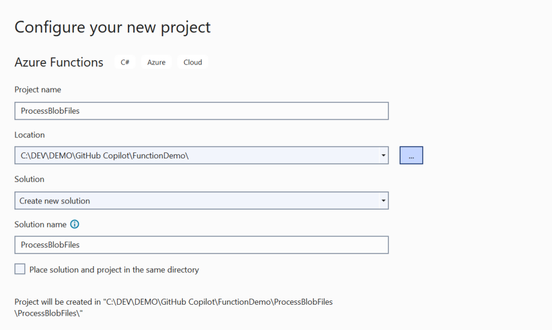
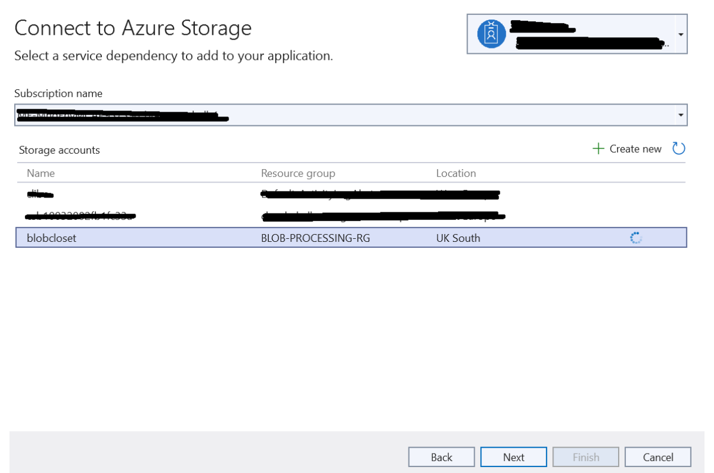
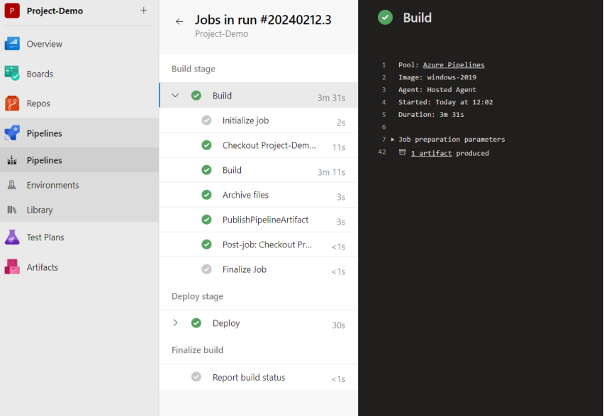

# Creating an Azure Function with a Blob Trigger

This includes adding the developed code to Azure Repo, and setting up an Azure Pipeline for deployment.

***

 ## Here's a detailed guide to walk you through the process.

### ***Step 1: Create an Azure Function App***

1. Log in to Azure Portal: Go to Azure Portal and log in with your credentials.

    https://azure.microsoft.com/en-gb/get-started/azure-portal

2. Create a Function App:

3. Navigate to Create a resource > Compute > Function App.

4. Fill in the necessary details such as Subscription, Resource Group (create a new one if needed), Function App name, Publish as Code, Runtime stack (choose according to your preference, e.g., .NET, Node.js), Version, Region, etc.

5. Click Review + create and then Create.

### ***Step 2: Develop Your Function***

1. Code Your Function: Use the in-built code editor in Azure Portal or your preferred IDE (e.g. Visual Studio, VS Code) to develop your function. The function logic should process the blobs (files) that are uploaded to the specified container in your Azure Blob Storage.

2. In this case, (using Visual Studio), create a new project and select ‘Azure Functions’ from the list of templates. Configure the project – Project Name, Location, etc.

    

3. Select the Functions worker, Function (Blob Trigger), Connection String Name and Path and Create.

4. Connect dependencies and select the Azure Storage that you want to use.

    

5. Complete the next screen to supply connection string, connection string value (pre-populated) and save the connection string in ‘Azure Key Vault’ for security.

6. In the next section, select the Azure Key Vault that contains your secrets.

7. Provide a name for the Key vault to allow connection.

8. Test Your Function: Test locally if you're using an IDE, by uploading a file to the blob container and checking the logs for execution details.

### ***Step 3: Add Code to Azure Repos***

https://azure.microsoft.com/en-gb/products/devops

1. Create a Repository:

    - Go to Azure DevOps and sign in.

    - Create a new project or select an existing one.

    - Inside the project, go to Repos and click on + New repository to create a new repository.

2. Push Your Code:

    - Initialize a Git repository in your function app's directory if you haven't already (git init).

    - Add the Azure Repo as a remote (git remote add origin <repository-url>).

    - Commit your changes (git add . and git commit -m "Initial commit").

    - Push the code to Azure Repos (git push -u origin master).

### ***Step 4: Create an Azure Pipeline for CI/CD***

1. Go to Pipelines: In your Azure DevOps project, navigate to Pipelines > New pipeline.

2. Select Repository: Choose Azure Repos Git and select your repository.

3. Configure the Pipeline: You can use the YAML editor to configure your pipeline. Azure DevOps provides a template for deploying an Azure Function. Adjust the template as necessary to suit your app's requirements.

4. The YAML file will typically include steps for restoring dependencies, building the project,

running tests, and deploying the function app to Azure.

5. Run the Pipeline: Save and run the pipeline. If configured correctly, this pipeline will automatically build and deploy your Azure Function app to Azure whenever changes are pushed to the specified branch in your Azure Repo.

    

### ***Step 5: Monitor Deployments and Function Executions***

1. Monitor Pipeline Runs: In Azure DevOps, you can monitor the progress and results of your pipeline executions.

2. Monitor Function App: In Azure Portal, navigate to your Function App to monitor its executions, view logs, and manage settings. 

### This guide provides a high-level overview of the process. Each step can have more detailed configurations based on your specific requirements, such as setting up environment variables, configuring deployment slots, and managing application settings in Azure Function App settings.

